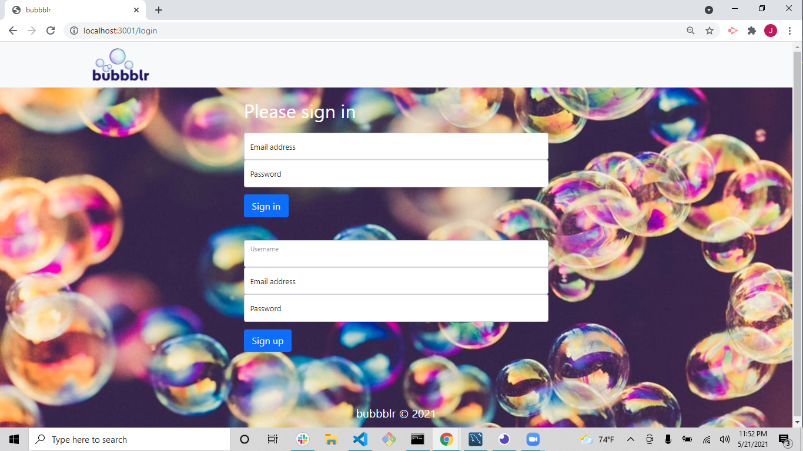

# bubbblr

Working as a team of 3 created the bubbblr app. Bubbbr allows live chat that can be tagged and compiled to allow brainstorming projects more efficient.

Project controllers were headed by JP Eiler and socket.io expert.
Project views were headed by David Boerm.
Project models were headed by Joel Cunningham.

https://bubbblr.herokuapp.com/

</img>